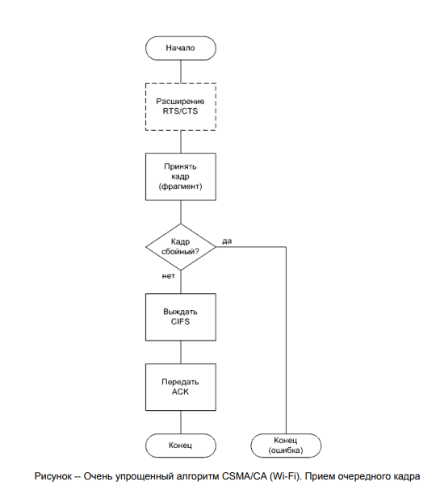

## 31. Классификация каналов в сети передачи данных

По направленности:
- симплексный - передача по каналу возможна только в одном направлении;
- полудуплексный - данные могут передаваться в обоих направлениях, но в один момент времени возможна передача только в одном направлении;
- полнодуплексный - данные могут передаваться в обоих направлениях одновременно.

Сейчас доминируют полнодуплексные каналы.

Последовательный канал может быть:
- выделенным - зарезервирован за определенной парой станций-абонентов;
- разделяемым - может использоваться несколькими станциями-абонентами;

По времени существования:
- коммутируемый – временный, создается только на время передачи информации, по окончании передачи информации и разъединении уничтожается;
- некоммутируемый – создается на длительное время с определенными постоянными характеристиками.

## 32-33.А. Типы и виды топологий сетей

Разделяют следующие типы топологий:
- Point-to-point - связывает две станции;
- Multipoint-to-multipoint - связывает более двух станций.

Однонаправленные (очень редко):
- Point-to-multipoint;
- Multipoint-to-point.

Разделяют два вида топологий:
- физическая топопогия - отражает физические связи
между устройствами.
- логическая топопология - отражает логические связи между устройствами.

## 32. Логические и физические топологии LAN

См. 32-33.А.

Для LAN характерны топологии:
- Шина (bus);
- Кольцо (ring);
- Звезда (star).

## 33. Логические и физические топологии WAN и RAS

См. 32-33.А.

Для WAN характерны топологии:
- Сеть (mesh);
- Ступица со спицами (hub-and-spokes);
- Полносвязаная сеть (full-mesh).

Характерной RAS-топологией является point-to-point.

Можно сказать, что для ГКС-технологий существует только одна типичная топология (произвольно связанная сеть), остальные можно рассматривать как ее частные случаи.

_Примечание. Под ГКС понимается глобальная компьютерная сеть_.

## 34. Особенности случайных методов доступа к моноканалу

В первую очередь алгоритмы затрагивают передатчики, то есть 
активные компоненты системы. Проблема заключается в 
«столкновениях» конкурирующих передатчиков.
Если находящиеся в равных условиях два либо более передатчиков
одновременно выдают сигналы в СрПД, то возникает противоречие. 

Таковое единовременно неразрешимое противоречие принято называть коллизией (collision). 

Коллизия может быть как логической (информационный конфликт) так и физической (несовместимые  физические процессы). 
Обычно коллизия возникает при попытках  установить противоположные логические уровни.

Ситуация с коллизией может затрагивать только станции, 
подключенные к одной СрПД, то есть сегмент компьютерной сети.
Сегмент, в котором возможно возникновение коллизий называют 
доменом коллизий (collision domain). 

Понятие коллизии имеет отношение не только к сигналу, а и к пакету.

При случайном методе существуют два подхода: 
- допускать коллизии  и как-то выходить из них (CSMA/CD);
- стараться максимально не допускать коллизии (CSMA/CA).

Все случайные методы основаны на использовании генератора 
случайных чисел, который используется для генерации случайных 
задержек при доступе к моноканалу.

На эффективность случайных методов наиболее существенно влияют следующие факторы:
- количество взаимодействующих станций;
- длина кадра;
- частота синхронизации;
- инертность среды передачи данных.

## 35. CSMA/CD (Ethernet)

CSMA/CD (Carrier Sense Multiple Access with Collision Detection) - множественный доступ с прослушиванием несущей и обнаружением коллизий.

 

передача очередного кадра

<!-- константы не относятся к рисунку, они для формулы ниже -->
- $Tcw$ – время окна коллизии, равное удвоенному времени прохождения сигнала между двумя максимально удаленными станциями;
- $Tj$ – время передачи jam-сигнала;
- $Ts$ – слот-тайм, минимальная неделимая единица времени при диспетчеризации, $Ts > Tcw + Tj$.

Сперва станция дожидается пока канал не будет свободен.

После этого посылает фрейм и ждет Tcw.

Если коллизия была обнаружена, то необходимо послать специальный jam-сигнал, чтобы другие станции тоже узнали о коллизии, и выждать Tcw. Jam-сигнал позволяет станциям синхронизировать начало отсчета случайных задержек.

После этого необходимо инкрементировать счётчик попыток, если количество попыток перевалит за 16, то считается, что в моноканале не удастся передать сообщение (ошибка).

Далее необходимо сгенерировать время для ожидания в слот-таймах:

В случае неудачи следует сгенерировать время для ожидания в слот-таймах:

$$0 <= r <= 2^k$$

где 
- $r$ – число, умножив которое на $Ts$ получается время для случайного выжидания; 
- $k = min (n, 10)$, $n$ – номер попытки.

После выжидания следует вновь дождаться свободности канала и повторить попытку отправки сообщения.

После удачной передачи сообщения счетчик должен обнулиться.

## 36. Кадр Ethernet

Кадр Ethernet состоит из следующих полей:
- Preamble – преамбула;
- SFD (Start Frame Delimiter) – разграничитель начала кадра;
- DA – адрес назначения;
- SA – адрес источника;
- Length/Type – длина или тип (если больше 600h);
- Data – данные;
- Pad – наполнитель, если размер для данных больше, чем реальная длинна передаваемого сообщения;
- FCS (Frame Check Sequence) – контрольная сумма, используется для обнаружения ошибок.

При сборке кадра учитываются ограничения на его длину:
ограничивается не только максимальная длина, но и минимальная.

При недостаче в поле данных вслед за ним в кадр вставляются
дополнительные октеты - наполнители (значения стандартом не регламентированы).

Параметр MTU (Maximum Transmission Unit) определяет максимальный размер вкладываемых данных. П

Применительно к Ethernet, если значение поля Length/Type больше либо равно 1536 (600h), то указывает тип инкапсулируемых данных. 

При необходимости, октеты-расширители дополняет кадр до тайм-слота (только в полудуплексном режиме).

Ethernet-заголовок имеет фиксированную длину.

Но, поскольку многие базирующиеся на Ethernet технологии (например, VLAN) имеют собственные подзаголовки, заголовок, а следовательно и весь кадр, может увеличиться, правда незначительно и не затрагивая MTU (такие кадры иногда называют baby giant). 

Некоторые технологии предусматривают значительное увеличение кадра уже за счет увеличения MTU. Например, параметр MTU технологии FCoE (Fibre Channel over Ethernet) равен 2500 байтам (такие кадры иногда называют mini jumbo). 

Наконец, многие производители оборудования Ethernet предусмотрели нестандартное (но в большинстве случаев совместимое) административное увеличение MTU вплоть до 9000 байтов - в первую очередь, для оптимизации пересылки больших объемов данных. Такие Ethernet-кадры называют гигантскими (jumbo).

## 37. CSMA/CA (Wi-Fi)

Гораздо более сложный алгоритм CSMA/CA (Carrier Sense Multiple Access with Collision Avoidance) - множественный доступ с прослушиванием несущей и избеганием коллизий.

Применительно к Wi-Fi, MAC-подуровень канального уровня поделен еще на два слоя. 

На нижнем слое расположен только один блок под названием DCF (Distributed Coordination Function) - функционал распределенного координируемого взаимодействия (составляет ядро алгоритма CSMA/CA). 

Все станции сегмента должны поддерживать DCF. 

Над DCF расположены:
1. PCF (Point Coordination Function) - функционал координируемого взаимодействия с использованием станции-координатора;
2. HCF (Hybrid Coordination Function) - функционал гибридного координируемого взаимодействия;
3. MCF (Mesh Coordination Function) - функционал сеточного координируемого взаимодействия.

Из них формируются следующие опциональные блоки:
1. PCF - функционал координируемого взаимодействия с использованием станции-координатора;
2. HCCA (HCF Controlled Access) -  метод управляемого доступа к каналам с помощью функции гибридной координации для контроля доступа к среде;
3. EDCA (HCF/MCF Contention Access) - конфликтный доступ к HCF/MCF;
4. MCCA (MCF Controlled Access) - контролируемый доступ к функционалу сеточного координируемого взаимодействия.

Кроме DCF, наибольший интерес представляет PCF.

Остальные блоки предназначены для поддержки QoS.

В настоящее время реализации Wi-Fi на физическом уровне (беспроводные) очень разнообразны - используются до десяти различных способов модуляции. Более того, для Wi-Fi характерно создание большого числа параллельных каналов.

Стандартом предусмотрены целых шесть вариантов отслеживаемых межкадровых интервалов --IFSes (InterFrame Spaces):
1. RIFS (Reduced IFS) -- сокращенный;
2. SIFS (Short IFS) -- короткий;
3. PIFS (PCF IFS) -- для PCF;
4. DIFS (DCF IFS) -- для DCF;
5. AIFS (Arbitration IFS) -- для QoS-арбитража;
6. EIFS (Extended IFS) -- расширенный.

Отслеживание различных IFSes в различных ситуациях влияет на способность станции «видеть щели» между кадрами, а значит и на способность «вклиниваться» в пересылку.

Количество слот таймов находится в диапазоне:

$$0 <= r <= CW,$$

где $CW$ (contention window) – окно состязаний, находится в диапазоне ($𝐶𝑊𝑚𝑖𝑛 ≤ 𝐶𝑊 ≤ 𝐶𝑊𝑚𝑎𝑥$) и берется из ряда $\{2^n - 1: (7, 15, 31, …)\}$, крайние значения зависят от возможностей физического уровня (типичные значения $𝐶𝑊𝑚𝑖𝑛 = 15$, $𝐶𝑊𝑚𝑎𝑥 = 1023$).

## 39. Особенности детерминированных методов доступа к моноканалу

Детерминированные методы доступа к моноканалу хорошо ложатся на кольцевую топологию. Кольцо можно представить как моноканал, один такт которого равен полному либо частичному обходу кадром всех станций.

В кольце не может возникнуть коллизий аналогичных коллизиям при шинной топологии, однако есть логические коллизии: если станция имеет собственный кадр для передачи и при этом получила из кольца ещё один кадр, то появляется задача определения какой кадр передавать дальше.

Для решения логических коллизий внедряется система приоритетов и арбитра, управляющего ими. Такой арбитр принято называть маркером (token).

На эффективность детерминированных методов наиболее существенное влияние оказывают те же факторы, что и в ситуациях со случайными методами:
- количество взаимодействующих станций;
- частота синхронизации;
- длина кадра.

## 40. Алгоритм Token Ring

Token Ring — протокол передачи данных в локальной вычислительной сети (LAN) с топологией кольца и «маркерным доступом». Находится на канальном уровне модели OSI.

В Token Ring предусмотрено централизованное управление, которое реализуется управляющей станцией (станцией-монитором). 

В задачи управляющей станции входит инициализация подключившихся к кольцу станций, тактирование кольца, контроль над валидностью маркера и предотвращение зацикливания.

Функции станции-монитора:
1. инициализировать подключившиеся к кольцу станции;
2. тактировать работу кольца;
3. контролировать наличие и валидность маркера;
4. предотвращать зацикливания.

Есть 4 вида передаваемых последовательностей:
- Token(маркер);
- Frame(кадр);
- Abort Sequence(прерывающая последовательность);
- Fill(заполняющая последовательность).

Расшифровка полей структуры маркера, кадра, прерывающей последовательности:
1. SD (Starting Delimiter) - начальный разделитель;
2. AC (Access Control) - контроль доступа;
3. FC (Frame Control) - контроль кадра;
4. DA (Destination Address) - адрес назначения;
5. SA (Source Address) - адрес источника;
6. RI (Routing Information) - информация о маршрутизации (может отсутствовать);
7. INFO (Information) - данные (могут отсутствовать);
8. FCS (Frame Check Sequence) - контрольная сумма;
9. ED (Ending Delimiter) - конечный разделитель;
10. FS (Frame Status) - состояние кадра;
11. IFG (InterFrame Gap) - межкадровый интервал;
SD и ED фактически являются флагами начала и конца кадра.

Между IFG и SD передается заполняющая последовательность.

Формат поля контроля доступа:
1. P (Priority bits) - текущий уровень приоритета;
2. T (Token bit) - идентификатор маркера: 0 - маркер, 1 - кадр;
3. M (Monitor bit) -- бит монитора;
4. R (Reservation bits) - запрашиваемый уровень приоритета. 

Формат поля состояния кадра:
1. A (Address-recognized bit) - флаг распознания адреса (дублируется);
2. C (frame-Copied bit) - флаг копирования кадра (дублируется);
3. r (reserved) - зарезервировано. 

Маркер передается по цепочке от станции к станции. Если у станции нет кадра для передачи, то она передает маркер дальше, если есть, то она захватывает маркер и преобразует его в кадр для передачи. Если передаваемый кадр придет на станцию, с кадром большего приоритета, то дальше будет передаваться он.

После прихода кадра к станции-назначению, она выставляет поля A и C, таким образом показывая, что сообщение успешно прочитано. За удаление кадра отвечает станция, его создавшая. После этого маркер освобождается и передается далее.

Существуют оптимизация early token release: сразу вслед за кадром передается новый маркер, а старый маркер не воссоздается, таким образом в кольце одновременно может передаваться несколько кадров.

Владение маркером ограничено во времени и контролируется с помощью таймера THT (Token Holding Time).

<!-- TODO: ладно -->
<!-- ладно -->
Стековая станция – станция, имеющая два стека LIFO, использующихся для сохранения старого и нового приоритетов при его замене в кольце.

## 41. Реализации детерминированных методов доступа к моноканалу

Некоторые детерменированные методы доступа к моноканалу:
- ARCNET - была популярна до распространения Ethernet, алгоритм Token Ring, но без приоритетов, логическая топология – однонаправленное кольцо, физическая топология – шина или звезда;
- Token Bus - разрабатывали параллельно с Token Ring, стандарт 802.4, логическая топология – однонаправленное кольцо, физическая топология - шина;
- FDDI/CDDI (Fiber/Copper Distributed Data Interface) - FDDI разрабатывался специально для оптических СрПД, но быстро был вытеснен Fast Ethernet, логическая топология – однонаправленное кольцо с резервированием, физическая топология – двойное кольцо;
- 100VG-AnyLAN - была альтернативой Fast Ethernet, гибрид между Ethernet и Token Ring с совместимостью с их кадрами, стандарт 802.12, логическая топология – дерево, физическая топология - дерево.

## 42. Адресация в компьютерных сетях и классификация кадров

Адресация всегда «привязана» к некоторому протоколу, а
протокол, в свою очередь, «привязан» к уровню модели OSI. Поэтому
закономерно, что на каждом из уровней присутствует своя независимая система адресации.

В форматах большинства пакетов обязательно должны присутствовать адрес назначения и адрес источника.

В каждом пакете должны присутствовать по крайней мере адреса канального уровня.

В большинстве же практических реализаций семейств протоколов, кроме адресации на канальном уровне, предусмотрена адресация на сетевом (в связке с транспортным) и прикладном уровнях.

Адреса канального уровня «зашиваются» в сетевое оборудование при его производстве, поэтому повторяться не должны. Они не предполагают возможность пользовательского вмешательства и их считают абсолютно уникальными. Часто (в том числе Cisco) такую адресацию называют физической (physical). 

Адреса сетевого и прикладного уровней назначают пользователи. Часто (в том числе Cisco) такую адресацию называют логической (logical).

Существует 4 типа адресации:
- unicast – пакет предназначен конкретной станции;
- broadcast – пакет должен быть обработан всеми станциями;
- multicast – пакет должен быть обработан всеми станциями в определенной группе;
- anycast – пакет должен быть обработан одной станцией из группы (самая сложная, подразумевает наличие алгоритма выбора конкретной станции из группы).

<!-- TODO: думаю не полностью ответил на вопрос ??классификация кадров?? -->

## 43. MAC-адреса

MAC-адрес – это адрес канального уровня модели OSI, используется для уникальной идентификации сетевого оборудования. 

Уникальность MAC-адресов контролирует IEEE Registration Authority.

МAC-адрес состоит из 48 бит.

Поля MAC-адреса:
- OUI (Organizationally Unique Identifier) - уникальный идентификатор организации (производителя);
- U/L (Universal/Local) - признак универсальности-локальности адреса;
- I/G (Individual/Group) - признак индивидуального-группового адреса;
- Extension Identifier - идентификатор-наполнитель.

OUIs выдают централизовано, уникальность оставшейся части должны обеспечивать сами организации (любым способом по своему усмотрению).

По правилам IEEE MAC-адреса записывают в следующей нотации:

$${XX-XX-XX-XX-XX-XX}$$

где $X$ - шестнадцатеричная цифра в верхнем регистре, но очень часто используют и альтернативные нотации.

Все юникаст-MAC-адреса должны иметь нулевое значение бита I/G.

Адрес 

$$FF-FF-FF-FF-FF-FF$$

принято использовать в качестве бродкаст адреса.

## 44. Заголовок IPv4

Поля заголовка IPv4:
- Version – равно 4;
- IHL (Internal header length) – длина заголовка (в 32-битных словах, минимум равно 5 минимум равно 5 - первые пять строк картики);
- Total Length – общая длинна данных (в байтах, не может превышать $2^{16} − 1$);
- Identification – уникальный идентификатор пакета (нужен при фрагментации);
- Flags:
    - первый бит пустой;
    - второй бит - флаг DF (Don’t Fragment);
    - третий бит - флаг MF (More Fragments);
- Fragment Offset – смещение текущего фрагмента;
- Time to Live – время жизни (при каждой ретрансляции уменьшается, когда равно нулю пакет уничтожается);
- Protocol – протокол, инкапсулируемый в поле данных;
- Header Checksum – контрольная сумма заголовка;
- Source Address – адрес источника;
- Destination Address – адрес назначения;
- Options – опции, например, связанные с безопасностью, размер вариативен;
- Padding – наполнитель для выравнивания опций до 32 бит.

## 45. Заголовок IPv6

Заголовок IPv6 гибкий: сколько заголовков нужно, столько и вставляется.

Поля заголовка IPv6:
- Version – равно 6;
- Payload length – длина полезной нагрузки;
- Next header – селектор следующего заголовка (аналог поля Protocol в IPv4);
- Hop Limit – ограничитель числа прыжков (аналог поля Time To Live в IPv4);
- Source Address – адрес источника;
- Destination Address – адрес назначения.

Полноценная реализация IPv6 должна поддерживать следующие заголовки:
1. IPv6 header - IPv6-заголовок;
2. Hop-by-Hop Options header - заголовок опций ретрансляции;
3. Destination Options header - заголовок предназначенных станции назначения опций;
4. Routing header - маршрутизационный заголовок;
5. Fragment header - заголовок фрагмента;
6. Authentication header - заголовок протокола AH (связано с защитой информации);
7. Encapsulating Security Payload header - заголовок протокола ESP (связано с защитой информации);
8. Upper-layer header - заголовок протокола вышестоящего уровня.

## 46. Протокол ARP

Группа протоколов под названием ARPs (Address Resolution Protocols) предназначена для восстановления соответствия между MAC-адресами и IP-адресами.

Под прямым ARP понимают нахождение MAC по IP. Обратное преобразование выполняется по протоколу RARP (Reverse Address Resolution Protocols).

Поля пакета ARP:
- Hrd (Hardware) – тип оборудования (Ethernet - 1);
- Pro (Protocol) – протокол (IP - 800h);
- HLn (Hardware address Length) – длина аппаратного (физического) адреса в байтах;
- PLn (Protocol address Length) – длина протокольного (логического) адреса в байтах;
- Op (Opcode) – код операции: 1 – Request, 2 – Reply и д.р.;
- SHA (Sender Hardware Address) – аппаратный адрес станции-отправителя;
- SPA (Sender Protocol Address) – протокольный адрес станции-отправителя;
- THA (Target Hardware Address) – аппаратный адрес станции-получателя;
- TPA (Target Protocol Address) – протокольный адрес станции-получателя.

## 47. Структура Системы DNS

Протокол DNS _(Domain Name System «система доменных имён»)_ предназначен для восстановления соответствий между IP-адресами и адресами прикладного уровня.

Домен – совокупность устройств, работающих в рамках некоторых единых правил.

DNS нельзя однозначно сопоставить с моделью OSI.

Система DNS соответствует клиент-серверной модели и включает три основных компонента:
- Domain name space и Resource Records(Пространство доменных имен и ресурсные записи);
- Name servers (сервер, преобразующий доменные имена, с которыми работают пользователи, в понятные компьютерам IP-адреса или в обратном направлении);
- Resolvers (программы, отвечающие на запросы клиентов).

Адресное пространство доменных названий имеет иерархическую древовидную структуру. 

Каждый узел дерева обозначают меткой длиной от 0 до 63 байт (должна начинаться с буквы и может иметь в названии буквы любого регистра, цифры и символ '-'). 

Полная длина доменного названия не может превышать 255 байт. Метка с нулевой длиной является корнем дерева. 

Метки разделяют точками, и корневая метка является крайней справа. Доменное название может быть как абсолютным (absolute), то есть содержащим всю цепочку меток от станции до корневой метки, так и относительным (relative), то есть содержащим только часть меток.

## 48. Сообщения DNS

Заголовок присутствует всегда, остальные поля вариативные:
- Header – заголовок;
- Question – вопрос;
- Answer – ответ;
- Authority – авторитетный ответ;
- Additional - дополнение.

Структура заголовка сообщения:
- ID – идентификатор программы, сгенерировавшей запрос;
- Q/R – флаг запроса-ответа: 0 – запрос, 1 – ответ;
- Opcode – код операции (запроса);
- AA – флаг авторитетного ответа;
- RCODE – код ответа;
- QDCOUNT (Query DNS COUNT) – количество Resource Records в поле Question;
- ANCOUNT (Answer COUNT) – количество Resource Records в поле Answer;
- NSCOUNT (Name Server COUNT) – количество Resource Records в поле Authority;
- ARCOUNT (Additional Records COUNT) – количество Resource Records в поле Additional.

## 49. Виртуальные соединения в сети передачи данных

Одним из ключевых терминов транспортного уровня является термин соединения (connection). Если абоненты находятся в состоянии готовности передавать или принимать данные, то считают, что между ними установлено соединение.

Соединение может быть выражено неявно.

Существуют 2 вида соединений:
- Физические;
- Виртуальные.

Абоненты-программы физически соединены быть не могут, а значит к ним применимы только виртуальные соединения.

Существуют два способа организации взаимодействия:
- Без гарантированной доставки – усилия по доставке сообщений в СПД предпринимаются, но никаких гарантий нет (при необходимости, соответствующий контроль возлагается на программы-абоненты);
- С гарантией доставки – алгоритм работы транспортной службы гарантирует доставку пакетов.

Соединения без гарантированной доставки смысла не имеют.

Сокет – привязка к виртуальному каналу, соединяющему между собой два взаимодействующих между собой виртуальных процесса, с учетом всех трех уровней адресации.

## 50. Классификация оконных механизмов, используемых в сети передачи данных

Оконный метод базируется на подходе передачи нескольких пакетов перед ожиданием квитанций.

По количеству передаваемых пакетов окна классифицируют на:
- Статические – неизменяемый размер окна (заложен в протокол или устанавливается на весь сеанс обмена);
- Динамические – размер окна может изменяться в процессе передачи сообщений.

По способу обработки очереди пакетов, окно может быть:
- Фиксированным – перед формированием следующего окна должны быть приняты все соответствующие квитанции;
- Скользящим – существует возможность сдвигать окно относительно последовательности пакетов.

Наиболее сложным и гибким считается динамическое скользящие окно.

## 51. Структура системы TCP

TCP базируется на динамическом скользящем окне.

TCP соответствует клиент-серверной модели.

Применительно к каждому TCP-соединению нужно выделять приложение, производящее или потребляющее сетевые данные, и TCP-процесс, предоставляющий коммуникационные услуги (например, специальный драйвер ОС).

Синхронизировать работу приложения и TCP-процесса можно только с помощью буферизации.

TCP-интерфейс, которым пользуется приложение, состоит из примитивов для работы с буфером, позволяющих контролируя записывать или считывать данные.

Доступ к буферу имеет и TCP-процесс, который отслеживает наполнение буфера и, используя ресурсы более низких уровней, организует прием или передачу данных.

Предназначенное для передачи сообщение разбивается на сегменты.

Минимальной учитываемой в окне единицей данных является октет, то есть байт.

Все байты сообщения последовательно нумеруются так называемыми
последовательными номерами - _SNs (Sequence Numbers)_.

Нумерация начинается с некоторого начального последовательного
номера - _ISN (Initial Sequence Number)_, который как правило не равен нулю, а генерируется реализациями случайно (например, на основе текущего времени) для того чтобы лучше управлять соединениями (например, после их ненормальных завершений).

Принято, что сам ISN в нумерацию байтов не включается, то есть номер первого байта сообщения больше ISN на единицу.

Номером сегмента является SN первого байта данных в нем.

По разным понятным причинам длина сегмента может варьировать, но она имеет ограничениее, поэтому важное значение имеет конфигурационный параметр _MSS (Maximum Segment Size)_ - максимальная длина сегмента (по умолчанию 536 байтов).

По мере считывания принимающим приложением упорядоченных байтов из буфера окно скользит относительно последовательности сегментов сданными.

Если размер текущего окна приема равен нулю, а сегменты с данными продолжают поступать, то возникает переполнение.

## 52. Заголовок TCP

Структура заголовка TCP:
- Source Port – программный порт источника;
- Destination Port – программный порт назначения;
- Sequence Number (SN) – последовательный номер сегмента;
- Acknowledgment Number (AN) – подтверждающий номер;
- Data Offset – смещение данных;
- Reserved – зарезервировано (должно равняться нулю);
- URG – флаг значимости указателя на экстренные данные;
- ACK – флаг значимости подтверждающего номера;
- SYN – флаг синхронизации последовательных номеров;
- FIN – флаг последних данных;
- Window (W) – предлагаемое окно;
- Checksum – контрольная сумма;
- Urgent Pointer – указатель на экстренные данные;
- Options – опции (например, MSS);
- Padding – наполнитель.

## 53. Протокол TCP

Функционирование оконного механизма TCP базируется на использовании трех полей в заголовке сегмента: SN, AN, W и трех флагов: SYN, ACK, FIN.

Установление TCP-соединения, известное как «тройное рукопожатие» (three-way handshake), основывается на использовании флагов SYN и ACK.

Алгоритм трехстороннего рукопожатия:
1. Сначала TCP-процесс - инициатор взаимодействия (на стороне клиента) отправляет служебный сегмент с установленным флагом SYN, тем самым сообщая о своих намерениях (первое «рукопожатие»).
2. Затем запрашиваемый TCP-процесс (на стороне сервера), если он согласен взаимодействовать, подтверждает это ответным служебным сегментом с двумя установленными флагами SYN и ACK (второе «рукопожатие»).
3. Наконец, инициатор отвечает еще одним служебным сегментом с установленным флагом ACK, тем самым подтверждая подтверждение (третье «рукопожатие»).

Хоть процесс установления соединения несимметричен, после его установления обмен данными может происходить в полнодуплексном режиме (т.е. в оба направления). 

Таким образом TCP-процесс, находящийся по одну сторону соединения, одновременно может быть как передатчиком данных, так и приемником.

Флаг SYN используется только при установлении соединения, а флаг ACK – в каждом ответном сегменте.

Поле SN пересылаемого сегмента отражает собственный SN этого сегмента, а поле AN указывает SN ожидаемого сегмента, коим является следующий по порядку сегмент.

После синхронизации SNs соединение считается установленным
(established).

Размер предлагаемого окна в поле W может изменяться каждый раз при посылке сегмента. Если W=0, то это расценивается как запрет на передачу данных.

TCP предоставляет гарантию доставки, которая реализуется через так называемые тайм-ауты.

Передающий TCP-процесс определяет потерю сегмента с данными либо его подтверждения по отсутствию этого подтверждения в течение установленного интервала времени. После наступления тайм-аута сегмент с данными передается повторно. 

Отрицательные подтверждения не предусмотрены вообще. Принимающий TCP-процесс подтверждает все принятые сегменты с данными, причем подтверждает всегда. При этом если принята копия (что говорит о потере подтверждения), то она удаляется. Получение сегмента с SN больше ожидаемого говорит о возможной потере сегментов с данными или о разупорядочивании.

Флаг FIN используется для закрытия соединения с одной стороны. Если флаг FIN посылается только одной стороной, то соединения называют полу открытым. В таком состоянии сторона с закрытым соединением может только принимать данные и отправлять ACK, но не способно передавать данные.

## 54. Усовершенствования протокола TCP

Под синдромом глупого окна понимают несоответствие окна передачи с состоянием приемника, тем самым, не позволяя его либо нагрузить, либо разгрузить. 

Существует два решения:
- Нэгла - помогает при отправке небольших сегментов;
- Кларка - помогает в случаях, когда принимающая сторона имеет небольшое предлагаемое окно.

Для борьбы с перегрузками в СПД существует 4 решения:
- Медленный старт (подразумевает плавное увеличение размера окна, а не скачком);
- Избегание затора (подразумевает сдерживание экспоненциального роста размера текущего окна передачи после преодоления им некоторого порога, обычно применяется после медленного старта);
- Быстрая повторная передача (подразумевает уведомление принимающей стороной передающую о потере пакета, с последующей повторной отправкой потерянного пакета до истечения тайм-аута).

    

- Быстрое восстановление (подразумевает переход к избеганию затора после обнаружения оного, минуя медленный старт)

    

Последствия потерь и разупорядочивания сегментов заключаются в
разрушении «маятника» взаимодействия и приводят к необходимости еще одной важной оптимизации, четко проявляющейся при быстрой повторной передаче.

Согласно базовому алгоритму все сегменты должны быть подтверждены, а значит, после быстрой повторной передачи принимающая сторона должна послать все недостающие подтверждения.

Стороны могут «договориться», что текущий AN отражает номер первого ожидаемого получателем сегмента плюс автоматически подтверждает все сегменты с меньшими номерами (cumulative acknowlegement).

## 55. Протокол UDP и заголовок UDP

Протокол транспортного уровня _UDP (User Datagram Protocol, RFC 768)_ реализует способ пересылки данных без гарантии доставки, часто называемый дейтаграммным (datagram, хотя user datagram - это пакет с контролируемыми пользователем данными, а datagram - это любой пакет c данными).

Структура заголовка UDP:
- Source Port – программный порт источника;
- Destination Port – программный порт назначения;
- Length – длина датаграммы включая заголовок (в байтах);
- Checksum – контрольная сумма (псевдозаголовка + заголовка + данных).

При вкладывании UDP-дейтаграммы в IP пакет, между ними вставляется UDP-псевдозаголовок, дублирующий некоторые поля из основного IP заголовка.

## 56. Классификация и характеристики сред передачи данных

Все основные в КС СрПД можно разделить на пять типов:
- Коаксиальные кабели;
- Кабели на основе витых пар;
- Оптоволоконные кабели;
- Эфир;
- Телефонные пары.

По области применения кабели делят на:
- Кабели для внешней прокладки (СПД на улице);
- Кабели для внутренней прокладки (СПД в помещениях);
- Оконечные кабели (для подключения рабочих мест).

К кабелям внешней прокладки выдвигают больше требований, чем к кабелям внутренней.

Многие сведения о характеристиках кабеля производители указывают на изоляции.

В простейшем случае отдельный провод состоит из физического
проводника (conductor) и изоляции (isolation).

Проводники могут быть одножильными (solid) и многожильными(stranded).

Отдельно выделяют так называемые витые (twisted) провода. Обычно свиты два провода, образующие дифференциальную пару.

Традиционно кабели измеряют метрами или футами (1 ft = 30,48 sm). 

Сечение проводников, используемых в КС(и не только), принято измерять в AWG (American Wire Gauge): диаметр 1 mm соответствует 18 AWG (сечение 0,78 mm 2; максимальный ток 2,36 A - при максимально допустимой плотности тока 3 A/mm 2).
Например, стандартное сечение жилы витой пары равно 24 AWG
(диаметр около 0,5 mm).

## 57. Среды передачи данных на основе коаксиальных кабелей

Для формирования сегмента на базе коаксиального кабеля необходимо соответствующее количество BNC-разъемов (для подключения к рабочей станции), T-соединителей (для вывода кабеля в сторону рабочей станции) и пара терминаторов (на концах кабеля), один из которых заземляют.

Коаксиальные кабели выпускаются черными, реже серыми.

## 58. Среды передачи данных на основе витой пары

Выделяют 4 вида витых пар.

Где TP – Twisted Pair, S – Shielded, U – Unshielded + может быть F – Foiled (если для изготовления экрана применена фольга)

Обычно витыми парами соединяют разноранговое сетевое оборудование (например, пользовательскую станцию подключают к коммутатору). Если надо подключить одноранговые устройства (например, две станции пользователя) используют кросс-кабели.

Для подключения кабелей на основе витых пар применяют разъемы RJ45.

У нас принято такое расположение проводов в штекере(568-B):

Обычные кабели имеют серый цвет, другие цвета (оранжевый, белый) говорят о более высоком качестве (например, по пожарной безопасности).